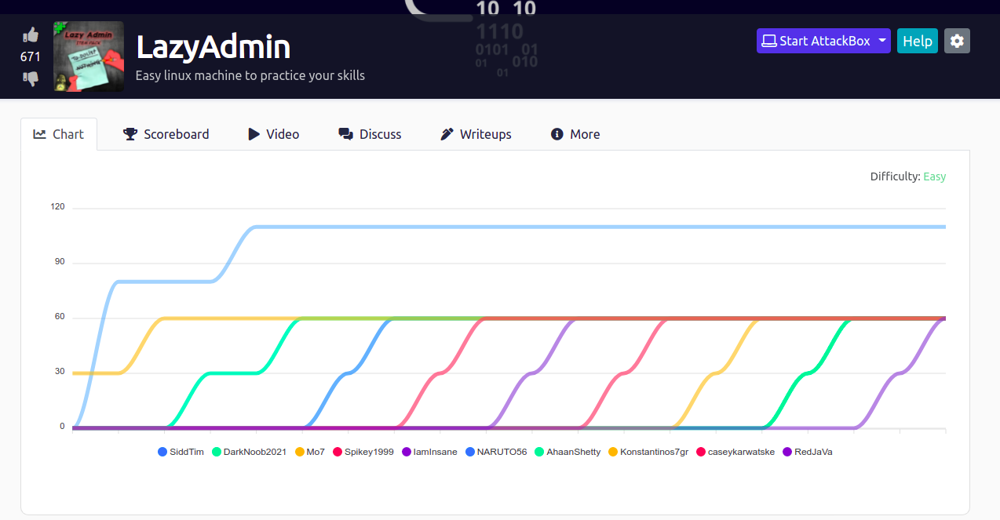
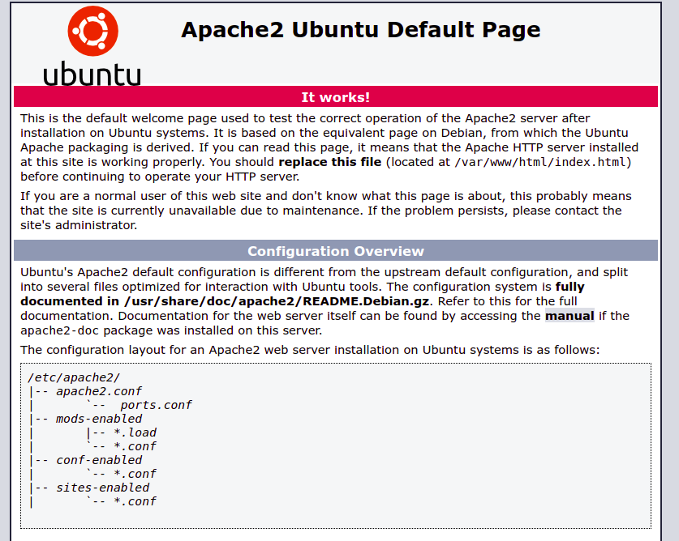
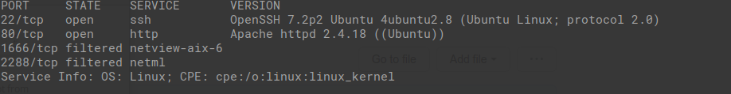
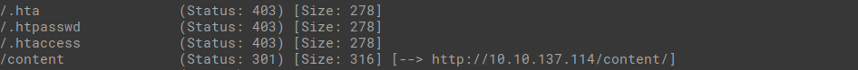

# LazyAdmin Write Up

I first started by starting the machine. I copied the IP of the machine, and entered it into my browser.

I got a default Apache Ubuntu page. Now I know it's a Linux webserver.

  

I went onto my terminal and I ran: nmap -sV {IP}

I learned that the webserver's http runs on port 80.

  

I decided to enumerate the http port of the webserver by using gobuster

I used gobuster dir -u {HTTP URL of IP} -w {wordlist.txt}

I found that there is a content directory. When I go to that URL, I find out that it uses SweetRice as the webserver's code.

  

I then enumerate the content directory to find anymore directories.

I used gobuster dir -u {HTTP URL of IP}/content -w {wordlist.txt}

I find more interesting directories...

  

