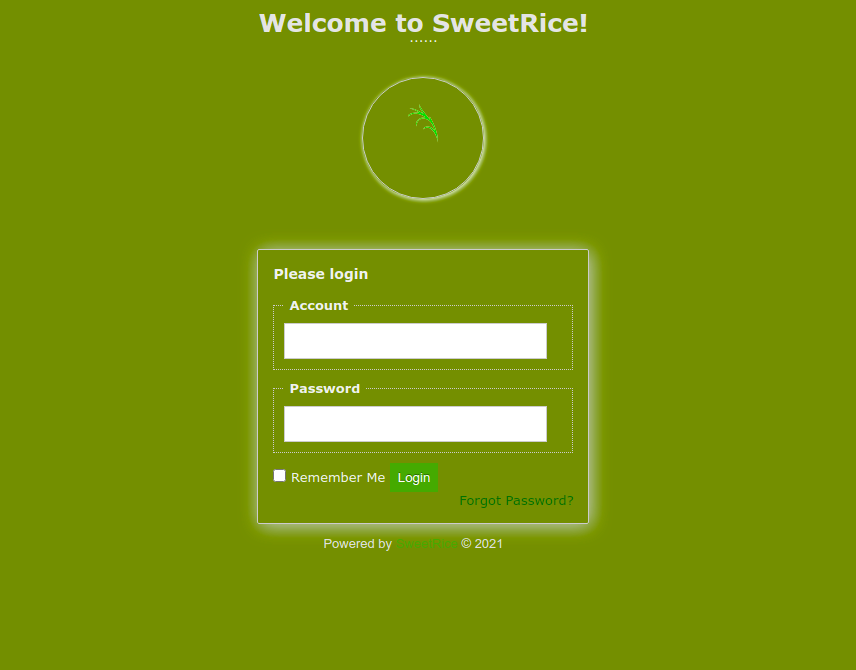

# LazyAdmin Write Up

I first started by starting the machine. I copied the IP of the machine, and entered it into my browser.

I got a default Apache Ubuntu page. Now I know it's a Linux webserver.

  

I went onto my terminal and I ran: nmap -sV {IP}

I learned that the webserver's http runs on port 80.

  

I decided to enumerate the http port of the webserver by using gobuster

I used gobuster dir -u {HTTP URL of IP} -w {wordlist.txt}

I found that there is a content directory. When I go to that URL, I find out that it uses SweetRice as the webserver's code.

  

I then enumerate the content directory to find anymore directories.

I used gobuster dir -u {HTTP URL of IP}/content -w {wordlist.txt}

I find more interesting directories...

  

I find the login page to the dashboard on the "as" directory

  

I searched the other directories and found the "inc" directory to have a backup of the mysql database.

  

I opened the sql file on a code editor and found a username and password...

  

I know its an MD5 hash. So I copied it and pasted it to hashes.com to decrypt it

Password was Password123. << A very secure password, right?

  

I tried using the username "master" and the password "Password123" on the dashboard

It logged me right in. I went through each directory trying to find vulnerabilities in the site.

I found I could upload a reverse shell script to the themes...

It requires a zip file, so I put the script into a zip file and uploaded it.

  

I remember that I can view the files to the themes in the directory /content/_themes

Woohoo! I found it!

  

On my terminal I entered the command nc -lvp {port}

Netcat will be listening to the port for any reverse shell. 

Now I am in!

  

First thing I did was look for user.txt

  

I also found that there is a perl script and a file that contains the login for the sql database

Next I did was check my sudo privileges... 

  

I find out I can run the perl script as sudo, but I do not have write access to it

So I checked what the script does...

  

It runs a shell script in etc/copy.sh

I checked that script and found a reverse shell code in it. So i editted that code by putting my own IP and port number...

I ran another nc -lvp {different port number}

I ran the command sudo perl /home/itguy/backup.pl

Now I got a reverse script with root access!

  

I ran cat root/root.txt and got the final code!

My suggestions are to make directory names random, do not leave the mysql backup on the same server, use hard to guess passwords, deny sudo access to scripts, and dont leave any reverse shell scripts on the webserver. :)

Here is the link to the tryhackme room if you want to try it out: https://tryhackme.com/room/lazyadmin
